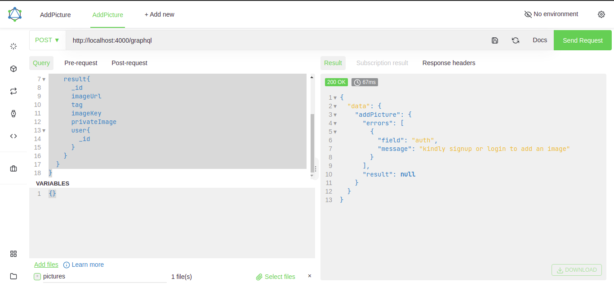

# Image-Repository

## Description

[Shopify](https://www.shopify.com/) Backend Developer Intern (Remote) - Winter 2022 Challenge project

Built with [Graphql](https://graphql.org/), [Node](https://nodejs.org/en/), [Mongodb](https://www.mongodb.com/) and [Typescript](https://www.typescriptlang.org/).

## Prerequisites

```bash
MONGO_DB_URL
TEST_DB_URL
SESSION_SECRET
S3_BUCKET_REGION
S3_BUCKET_NAME
AWS_ACCESS_KEY_ID
AWS_SECRET_ACCESS_KEY
COOKIE_NAME
```

> Provide values for the above keys in your .env file

## Installation

```bash
$ yarn install
```

## Running the app

```bash
# head over to http://localhost:4000/graphql
$ yarn start
```

## Test

```bash
$ yarn test
```

## Features

```bash
#signup mutation - signup auser with unique usernames.

mutation {
  signup(options:{
	username: "john",
	password: "johndoe"
  }){
  errors {
  	field
    message
  }
  user {
    _id
    username
  	}
  }
}
```

```bash
#login mutation - login a user.

mutation{
  login(username:"bob", password:"bobobob"){
    errors{
      field
      message
    }
    user{
      _id
      username
    }
  }
}
```

```bash
#logout mutation - logout a user.

mutation {
  logout
}
```

```bash
#me query - get logged in user.

query {
	me{
    _id
    username
  }
}
```

```bash
#upload one, bulk or enormous amount of image(s)

mutation AddPicture($pictures: [Upload!]!){
  addPicture(
		tag: ["tech", "computer"],
		privateImage: false,
		pictures: $pictures
	){
    errors{
      field
      message
    }
    result{
      _id
      imageUrl
      tag
      imageKey
      privateImage
      user{
        _id
      }
    }
  }
}
```

> To test file upload, head over to [Altair Graphql Client](https://altair-gql.sirmuel.design/) and paste in the AddPicture mutation above, to select the files, click on Variables at the bottom left, click on **Add files**. In the field that pops up, toggle the button labeled **1** to represent \* by simply clicking it. Change the name from **file** to **pictures**. On the right, click **select files**. Using the command key of your computer, select multiple images. After selecting, you will see the number of files you have selected adjacent to the field. Also pass the tag and privateImage field to indicate if the image(s) is/are a private image(s).



```bash
#get a picture by passing the image id

query{
  picture(id:"614639f6d35fce1cd433648b"){
    _id
    imageUrl
    tag
    user{
      _id
      username
    }
  }
}
```

```bash
#get all public images(s)

query {
  pictures{
    _id
    imageUrl
    tag
    imageKey
    user{
      _id
      username
    }
  }
}
```

```bash
#delete image(s) created by the user by passing the image id

mutation {
  deletePicture(
    id: [
      "61463fee441419534890c101"
      "61463fef441419534890c103"
    ]
  ) {
    errors {
      field
      message
    }
    result
  }
}
```

```bash
#search images by tag(s)

query {
  searchByTag(tag:["tech", "computer"]){
    _id
    imageUrl
    tag
    imageKey
    user{
      _id
      username
    }
  }
}
```

```bash
#get pictures of a particular user by passing the user id

query{
  getUserPictures(id:"61450ec950c3eea940e09679"){
    _id
    imageUrl
    tag
    imageKey
    privateImage
  }
}
```
